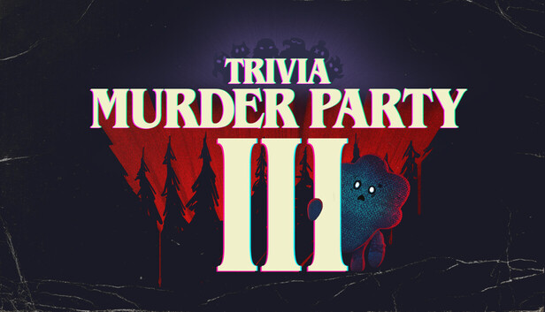
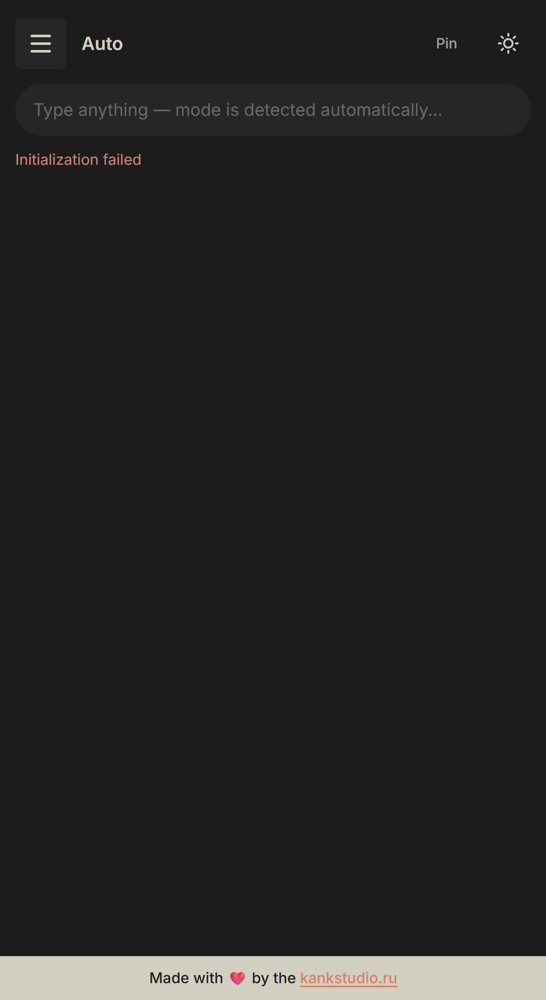
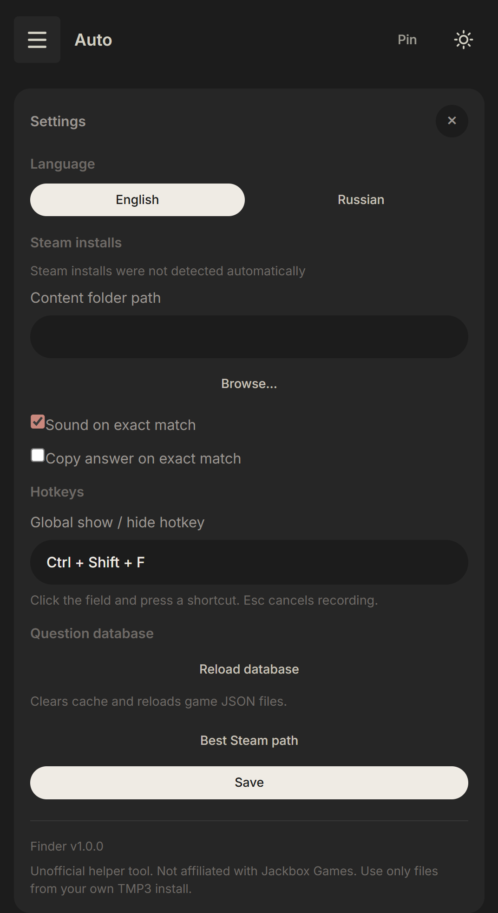

# TMP3 Finder

**Мгновенный поиск правильных ответов в [Trivia Murder Party 3 Demo](https://store.steampowered.com/app/3048060/Trivia_Murder_Party_3/) — локально, офлайн, без облака.**  
_Компактный desktop-помощник ~10 МБ на Tauri. Читает JSON из вашей игры — и только их._

<p align="center">
  <a href="https://github.com/lindan133/tmp3-finder/actions/workflows/ci.yml"></a>
  <a href="https://github.com/lindan133/tmp3-finder/releases/latest"></a>
  <a href="../LICENSE"></a>
  
  
  
</p>

<p align="center">
  <a href="../README.md">English</a> · <b>Русский</b>
</p>

<p align="center">
  <a href="https://github.com/lindan133/tmp3-finder/releases/latest"></a>
  &nbsp;
  <a href="https://kankstudio.ru"></a>
</p>

<p align="center">
  
</p>

<p align="center">
  
  &nbsp;&nbsp;
  
</p>

<p align="center">
  <b>Неофициальный fan-tool от <a href="https://kankstudio.ru">kankstudio.ru</a></b><br>
  <sub>Не связан с Jackbox Games · Не распространяет контент игры</sub>
</p>

---

**На экране категория Final Round. Четыре правильных ответа. Таймер уже идёт.**

TMP3 Finder индексирует локальные JSON-файлы TMP3 Demo, ищет по четырём режимам с fuzzy-поиском и копирует ответ в буфер одним кликом — или одной клавишей. Вызовите окно через **`Ctrl+Shift+F`**, закрепите поверх игры, сверните в трей когда не нужно.

> **Цель — не «красивый чит-оверлей», а правильный ответ в буфере до конца раунда.**

---

## ✨ Возможности

> [!NOTE]
> **Только Demo.** Сборка для [TMP3 Demo в Steam](https://store.steampowered.com/app/3048060/Trivia_Murder_Party_3/). Нужна легальная установка — Finder читает JSON из папки Content.

> [!TIP]
> **Быстрый старт:** скачайте [TMP3-Finder-Portable.exe](https://github.com/lindan133/tmp3-finder/releases/latest/download/TMP3-Finder-Portable.exe) — путь к Content обычно определяется автоматически.

### 🔍 Четыре режима поиска

**Вопрос**, **Final Round**, **Субъективный**, **VO / Реплики** — каждый режим ищет по своей схеме JSON.

### 🧠 Умный поиск

Fuzzy-сопоставление, процент совпадения, топ-3, подсказки при неверном режиме. Final Round: ответы **A→Z**; поиск по элементу списка копирует **один** ответ.

<table>
<tr>
<td width="50%">

**📌 Pin (поверх окон)**  
Окно поверх игры. Прозрачность 70–100% при включённом Pin.

</td>
<td width="50%">

**⌨️ Глобальный хоткей**  
Показать / скрыть: **`Ctrl+Shift+F`**. Режимы: **`Ctrl+1`…`4`**.

</td>
</tr>
<tr>
<td>

**🔄 База данных**  
Кэш JSON. **`Ctrl+R`** — перезагрузка при изменении файлов игры.

</td>
<td>

**🌐 RU / EN**  
Русский в **Настройки → Язык**. Меню трея тоже локализовано.

</td>
</tr>
<tr>
<td>

**🔔 Трей**  
Закрытие сворачивает в трей. Клик по иконке — показать / скрыть.

</td>
<td>

**⬆️ Обновления**  
Проверка при запуске; установка из настроек (при подписанном релизе).

</td>
</tr>
</table>

---

## 🚀 Быстрый старт

### 1. Скачать

| Файл | Для кого |
|------|----------|
| [**Portable .exe**](https://github.com/lindan133/tmp3-finder/releases/latest/download/TMP3-Finder-Portable.exe) | Без установки (~10 МБ) |
| [**Setup .exe**](https://github.com/lindan133/tmp3-finder/releases/latest/download/TMP3-Finder-Setup-1.2.0.exe) | NSIS-установщик |
| [**Setup .msi**](https://github.com/lindan133/tmp3-finder/releases/latest/download/TMP3-Finder-Setup-1.2.0.msi) | Корпоративная установка |

**Нужно:** Windows 10/11 + [WebView2](https://developer.microsoft.com/en-us/microsoft-edge/webview2/).

### 2. Установить TMP3 Demo

[Steam → Trivia Murder Party 3 Demo](https://store.steampowered.com/app/3048060/Trivia_Murder_Party_3/)

### 3. Запустить Finder

Путь к Content по умолчанию:

```
C:\Program Files (x86)\Steam\steamapps\common\Trivia Murder Party 3 Demo\TMP3\Content\TMP3\LooseData\Content
```

Изменить: **☰ → Настройки → Путь к папке Content**.

### 4. Искать и копировать

1. Режим через **☰** или **`Ctrl+1`…`4`**
2. Введите текст вопроса, ответа, категории или реплики
3. Клик по результату или **`Enter`** — копирование

---

## ⌨️ Горячие клавиши

| Клавиша | Действие |
|---------|----------|
| **`Ctrl+Shift+F`** | Показать / скрыть окно |
| **`Ctrl+1`…`4`** | Режимы поиска |
| **`Ctrl+R`** | Перезагрузить базу |
| **`Enter`** / **`Ctrl+Enter`** | Копировать топ-результат |
| **`Esc`** | Закрыть меню / очистить поиск |

---

## 📁 Файлы Content

| Файл | Обязателен |
|------|------------|
| `TMP3TriviaQuestion.json` | ✅ |
| `TMP3FinalRoundGrouping.json` | ✅ |
| `TMP3SubjectiveQuestion.json` | Нет |
| `VO.json` | Нет |

> [!IMPORTANT]
> Finder **не** распространяет контент игры — только читает ваши локальные файлы.

---

## 🛠️ Сборка

```bash
npm install
npm run dev      # разработка
npm test         # тесты
npm run dist     # portable + NSIS + MSI
```

Нужен [Rust](https://rustup.rs/). Подробнее — в [README на английском](../README.md).

---

## 🤝 Участие

- [Сообщить об ошибке](https://github.com/lindan133/tmp3-finder/issues/new?template=bug_report.yml)
- [Предложить функцию](https://github.com/lindan133/tmp3-finder/issues/new?template=feature_request.yml)
- [Обсуждения](https://github.com/lindan133/tmp3-finder/discussions)

---

<p align="center">
  <b>Хватит гадать. Начните находить.</b>
</p>

<p align="center">
  <sub>MIT License · <a href="../LICENSE">LICENSE</a></sub>
</p>
